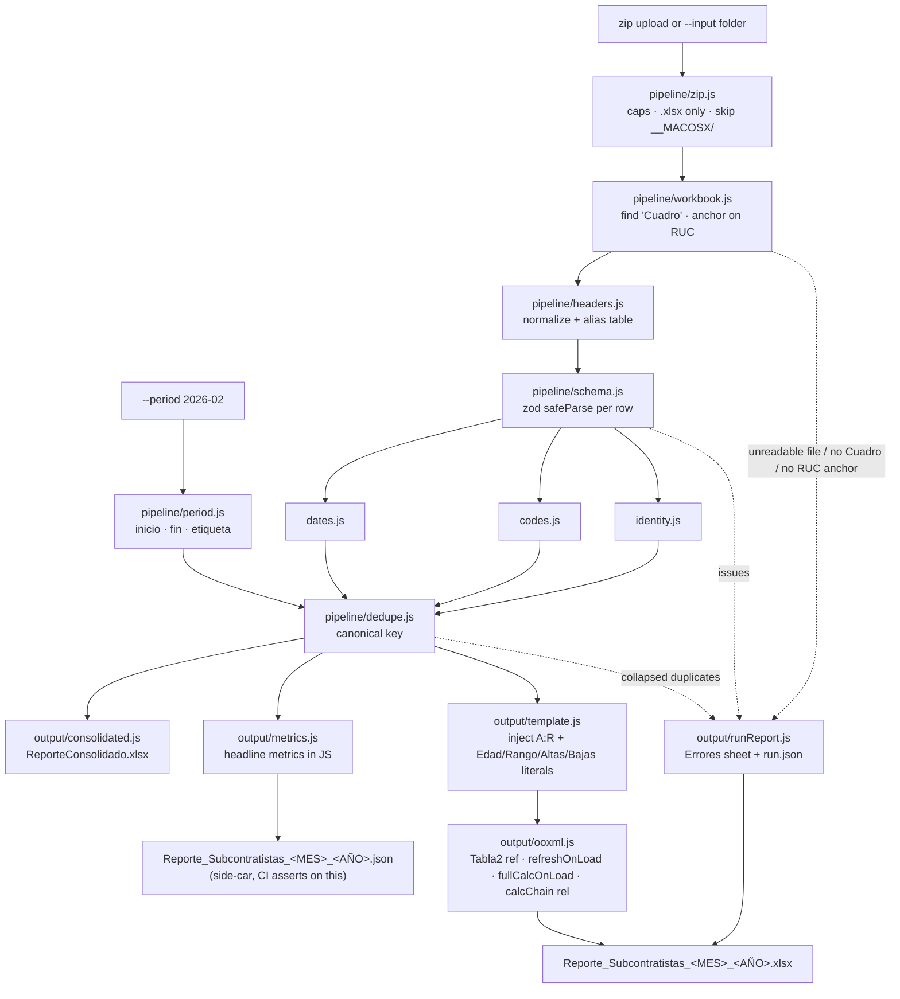

# Implementation Plan

This is the build order for the rework described in `01-current-state.md`, `02-shortcomings.md`, `03-expected-output.md` and `04-proposed-packages.md` — `00-summary.md` is the short version if you want the verdicts before the schedule. §9 traces every BUG ID and every acceptance criterion to a phase. It is sized for one developer working part-time, and it is constrained by one hard rule: **the monthly report must be runnable every month while the rework is in progress**. Every phase therefore lands next to the existing pipeline rather than inside it, and the old path stays live until two full months reproduce cleanly on the new one in a parallel run (§7).

**There is no prerequisite. Phase 0 can start today**, entirely from what is already in the repo. The owner has decided that retaining inputs, logs or any other historical material is not required, so this plan neither archives the uploaded zip nor keeps the extracted folder — the app may go on deleting its inputs, and that is intended behaviour rather than a defect. Correctness is proved two other ways: a hand-written fixture corpus with structural assertions on the generated workbook, and a parallel-run cutover in which one upload is processed by both pipelines and the two outputs are diffed on the spot. §4 sets that out, including what it does not prove.

---

## 1. Guiding principles and non-goals

**Non-goals, stated plainly so they stop coming up.** The `//TODO: Move project to Next.js` at `src/app.js:25` is the first thing to delete.

| Not doing | Why |
|---|---|
| A JS framework (Next.js, React, Vue) | One HTML page with a file input, used ~12 times a year by one person. A framework adds a build step, a dependency tree and an upgrade treadmill to a form. |
| Authentication / user accounts | Owner's constraint. The app is reachable by one operator; if that changes, put it behind nginx basic-auth or a VPN, not behind a login system in Node. |
| A database | The inputs are files, the output is a file, and nothing has to survive between runs — the owner has confirmed that no historical retention is required. A DB adds a schema to migrate and a backup to forget. |
| Docker / Kubernetes / microservices | It runs under pm2 on one self-hosted box. The deploy is `git pull; npm ci; pm2 restart`. Containerising a once-a-month script is pure overhead. |
| A formula engine (HyperFormula) or headless LibreOffice in the pipeline | Both rejected in `04-proposed-packages.md` — HyperFormula cannot parse `Tabla2[[#This Row],[…]]` (handsontable/hyperformula#126 and #241, both open since 2020), and running a workbook with 13 pivot tables through Calc risks shipping a corrupted compliance report. LibreOffice stays as an optional CI smoke test only. |
| TypeScript / ESM migration | Not forbidden, but not part of this plan. It would force a dependency re-pick (valibot over zod, tinypool over piscina) and buys nothing the tests do not. Revisit after cutover. |

**Principles.**

1. **The CLI is the product; the web page is a wrapper.** See §2.
2. **Build alongside, never in place.** New code lands under `src/pipeline/`. `src/excelConsolidation.js` and `src/excelReporting.js` are not edited until cutover, except for the surgical Phase-5 fixes to the download path that are safe and independently valuable. Phase 0 touches no production code at all.
3. **Determinism over convenience.** Nothing may depend on `new Date()` at run time. The report period is an input, not an inference. `getMonthAndYear()` at `src/excelReporting.js:69-77` — and its duplicate at `public/js/index.js:103-111` — are the archetype of what this plan removes.
4. **Fail loudly, once, with the subcontratista's name attached.** The single most damaging defect in the current app is that `catch { console.log("Error with: " + directory) }` at `src/excelConsolidation.js:74-77`, following a `console.clear()` at line 284, makes a whole subcontratista's workforce vanish into an output that still looks complete.
5. **Every rejected value becomes a line in a report the operator can act on**, not a silent `NaN`, not a blank cell, not a `#VALUE!`.
6. **The pivot sheets are the deliverable.** Any change that risks them needs an explicit decision from the owner (§5).
7. **Small dependency budget.** Per `04-proposed-packages.md`, the whole rework **adds two new runtime packages** (`dayjs`, `zod`), **promotes one transitive dependency to direct** (`jszip@^3.10.1`, already resident via xlsx-populate — `output/ooxml.js` depends on it, so it must be declared rather than borrowed), **re-registries one** (`"xlsx": "npm:@e965/xlsx@^0.20.3"`), **upgrades one** (`adm-zip` 0.5.10 → ^0.6.0), and **removes six** (`exceljs`, `googleapis`, `@google-cloud/local-auth`, `lodash`, `ejs`, server-side `axios`). Zero dev frameworks. Net dependency count goes *down*.

---

## 2. Target architecture

### 2.1 Module layout

```
src/
  cli.js                    Entry point. `node src/cli.js --input <zip|dir> --period 2026-02 --out <path>`.
  server.js                 Express: upload → job → SSE progress → download. Calls runPipeline(), owns no logic.
  config.js                 Paths, size/entry limits, TZ, template location. The only place env vars are read.
  pipeline/
    run.js                  runPipeline({inputPath, period}) → {rows, issues, stats}. Orchestration only.
    zip.js                  Safe extraction: entry-count/size caps, .xlsx-only, skip __MACOSX/, containment check.
    workbook.js             Open one .xlsx, locate the Cuadro sheet, anchor on RUC, emit raw rows + provenance.
    headers.js              Header normalizer (trim/collapse/NFD-fold/upper) + alias table + unmatched reporting.
    schema.js               The 18 canonical columns as a zod RowSchema: types, requiredness, coercion order.
    text.js                 Trim → collapse internal whitespace → strip CR/LF, plus uppercase where required.
    dates.js                Serial | text → {y,m,d} | null, with a reason. Excel-serial and day-first text.
    codes.js                TIPO TRABAJADOR / GENERO / ESTADO / TIPO DE CONTRATO LABORAL value maps.
    identity.js             RUC mod-11 check digit, DNI/CE shape, the canonical person key.
    dedupe.js               Dedupe on the canonical key, returning an itemised list of what was collapsed.
    period.js               "2026-02" → {inicio, fin, etiqueta:"2-2026"} as real serials.
    lookups.js              Hoja1 A2:B61 (distrito → Zona de Influencia) and L5:M9 (contratista → EPC), read from
                            the template at run time, never hard-coded in JS.
  output/
    consolidated.js         Write ReporteConsolidado.xlsx (kept purely as a diffable intermediate artefact).
    template.js             xlsx-populate: inject A:R plus the JS-computed literal columns into template.xlsx.
    ooxml.js                Post-write jszip patch: resize Tabla2, refreshOnLoad="1", fullCalcOnLoad="1",
                            drop the five <calculatedColumnFormula> elements, drop the dangling calcChain rel.
    metrics.js              The eight headline metrics of 03 §7.4, computed in JS from the consolidated records.
    runReport.js            Build the "Errores" sheet and the run.json log from the issue list.
  fixtures/                 Hand-written .xlsx inputs, one pathology each, + their expected JSON output.
                            Kilobytes, not megabytes. Synthetic identities.
  test/                     *.test.js, run by node:test. cases/*.json holds the pure-function tables.
tools/
  diff-reports.js           Cell-by-cell diff of two generated workbooks — the parallel-run gate (§4.4).
                            A developer tool, not shipped and not on the pipeline's path.
```

`config.js`, `period.js`, `dates.js`, `codes.js`, `identity.js`, `headers.js` and `dedupe.js` are all pure functions over strings — which is why the test corpus in Phase 0 is cheap and why the current defects (unreachable `case 1:` branches, `JSON.stringify` dedupe) survived: nothing ever called them in isolation.

### 2.2 Pipeline



### 2.3 Why the CLI is primary

Today the only way to produce a report is to upload a zip through a browser to a pm2 process and wait several minutes on a request that `req.setTimeout(6000000)` at `src/app.js:56` is trying and failing to keep alive. That has three consequences the CLI fixes for free:

- **Testability.** `runPipeline()` takes a folder path and a period string and returns data. Every fixture test in Phase 0 calls it directly — no HTTP, no upload, no browser. There is no way to write those tests against the current `app.js`, which is why there are no tests.
- **Determinism.** `node src/cli.js --input ./entrada/2026-02 --period 2026-02` produces February's numbers in August, because the period is an argument rather than an inference. The current pipeline cannot do this at all: the period comes from the wall clock in two places and the classification formulas come from `TODAY()-30`. This is about the *period* being explicit, not about the app holding on to anything — it deletes its inputs then and now, by design.
- **Re-running a month.** When a subcontratista sends a corrected workbook three weeks late, the operator reassembles the month's folder from what they were sent and re-runs one command with the same `--period`. Today that requires re-zipping everything and re-uploading, and the output filename will be wrong because it is derived from today's date.

`server.js` then becomes: accept the upload, validate it, extract it to a fresh per-run temp directory that a `finally` removes, call `runPipeline()` in a child process (`child_process.fork('src/cli.js')`), stream its progress lines to the `/progress` SSE endpoint that `src/views/progress.ejs` and `public/js/index.js:1-24` were already written against but which has never existed server-side, and hand back a download link to a filename the *server* computed. That is roughly 80 lines and it retires the timeout saga in the commit history (`increase timeout`, `update timeout` ×4, `fix server timeout issue`) by removing the reason it existed.

---

## 3. Phased delivery

Each phase is independently shippable and independently useful. Effort is "days of focused work" for one developer who already knows this codebase; at two days a week the whole plan is a ~3-month calendar, plus the two parallel months of §7 which run alongside normal operation rather than adding to the build.

### Phase 0 — Test harness and fixture corpus

**Goal.** A deterministic regression gate, buildable today from material already in the repo. Nothing after this is verifiable without it. **This phase changes no production code** — `package.json`, CI, and two new directories.

**Tasks.**

1. **Wire the runner.** `package.json` currently carries only the npm placeholder stub `"test": "echo \"Error: no test specified\" && exit 1"`. Replace it with `"test": "node --test src/test/"` and add `"test:cov": "node --test --experimental-test-coverage src/test/"`. No new dependency: Node 22, which CI already pins, ships `node:test` and `node:assert`.

2. **Hand-author the fixture corpus** in `src/fixtures/`. Kilobyte-scale `.xlsx` files, committed, one pathology each, written from knowledge of the pathology rather than extracted from any real month. `src/ReporteConsolidado.xlsx` (the last real run, 5,065 rows) and `src/template.xlsx` are **reference material for realistic shape** — the 18 column names in their canonical order, the value vocabularies, the sheet naming, the number formats — and nothing is copied out of them wholesale: identities are synthetic, five to twenty rows per file. `src/Formato Reporte subcontratas.xlsx` is the reference for the older input format.

   | Fixture | Pathology |
   |---|---|
   | `header-row-4.xlsx` | the header block does not start at A1 — a three-row preamble above it |
   | `leading-blank-column.xlsx` | column A blank; the table starts at B |
   | `columns-reordered.xlsx` | the 18 canonical columns in a different order |
   | `empresa-left-of-ruc.xlsx` | **`EMPRESA` to the LEFT of `RUC`** — the left-edge case, `03-expected-output.md` §1.2 step 4 |
   | `headers-accent-stripped.xlsx` | `DISTRITO SEGUN DNI`, `RUC ` with a trailing space, `  distrito  según   dni`, mixed case |
   | `contratista-spelled-correctly.xlsx` | `CONTRATISTA PRINCIPAL` — the *correct* spelling, which the canonical typo currently discards |
   | `duplicate-header.xlsx` | the same canonical header twice |
   | `sheet-not-named-cuadro.xlsx` | `CUADRO `, `cuadro`, `Cuadro 2026` |
   | `no-cuadro-sheet.xlsx` | no `Cuadro` sheet at all |
   | `column-shifted.xlsx` | A–D absent and the RUC number sitting in `APELLIDOS Y NOMBRES` — the 643-row block in miniature |
   | `text-dates.xlsx` | `04/07/1994`, `14/2/1989`, `3/5/1965`, `30/1/26`, plus the malformed years `09/10/205`, `05/09/20258`, `10-11-202-6` |
   | `fractional-serials.xlsx` | serials at `.791666…` (19:00) and `.833333…` (20:00), plus serial 60 |
   | `cese-sentinels.xlsx` | `-`, ` - `, `---`, `ACTIVO`, `""` in `FECHA CESE/BAJA` |
   | `dni-leading-zero.xlsx` | `09994533` stored as text, a 7-character DNI, a 9-character CE; RUCs that pass and fail the mod-11 check |
   | `codes-out-of-domain.xlsx` | `ESTADO` 184 and 160; `TIPO DE CONTRATO LABORAL` 0, 0.03, 5, 10, 11, 14; a `GENERO` value outside {masculino, femenino} — the input class that produced the `"undefined"` third gender column in `OCTUBRE_2025` |
   | `no-hpt-column.xlsx` | the older input format, `HPT` absent entirely (BUG-55) |
   | `text-columns-dirty.xlsx` | `" CLJ CONTRUCTORA SAC"`, an embedded CRLF in a company name, `"CERCADO DE  LIMA"` with a doubled internal space |

   Plus four **container** fixtures, which are folder- and zip-level rather than workbook-level: a subcontratista folder holding **two** `.xlsx`; a folder holding **zero**; a folder holding a `~$….xlsx` Excel lock file alongside a real workbook (one is sitting in `src/reportes/` right now); and a zip carrying a `__MACOSX/` entry with a `._` resource fork. Every fixture ships with its expected output as JSON beside it — that file is the assertion, so writing it is part of authoring the fixture, not a later step.

3. **Author the pure-function case tables.** `period.js`, `dates.js`, `codes.js`, `identity.js`, `headers.js` and `dedupe.js` are pure functions over strings, and they are where a silent wrong answer is most likely: a date read month-first, a check digit computed with the wrong weights, an alias that maps to the wrong canonical header — each produces a report that looks entirely normal. Commit the cases as data (`src/test/cases/*.json`: input, expected output, expected issue code) so the assertions are written once and the table grows per phase. Seed it with every date shape and every rejection in Phase 2 task 1; the header normalizer's inputs and the full alias table; the four coded domains including every out-of-domain value observed in the last run; the three real RUCs verified in `04-proposed-packages.md` plus the 23 that fail the check digit and the 1 that fails the format check; and the measured DNI length distribution (4 values at 7 characters, 4,202 at 8, 134 at 9, 2 at 10). The modules themselves land in Phases 1–2; the tables and the runner wiring land here, and each phase turns its own table green.

4. **Build the structural assertion helper**, used by every later phase. Unzip the output with `jszip` and assert:

   | | Assertion | Status today |
   |---|---|---|
   | (a) | `xl/tables/table1.xml` `ref` matches the real row count | passes; must keep passing |
   | (b) | all 13 `xl/pivotTables/pivotTable*.xml` parts and `xl/pivotCache/*` present and SHA-1-identical **to `src/template.xlsx`'s** — the template is the reference, never a past report | passes; must keep passing |
   | (c) | `[Content_Types].xml` and `xl/_rels/workbook.xml.rels` reference no absent part | fails (the dangling `calcChain` rel); Phase 3.4 |
   | (d) | `<calcPr … fullCalcOnLoad="1">` in `xl/workbook.xml` and `refreshOnLoad="1"` on `pivotCacheDefinition1.xml` (AC 21) | fails by design — template and output both ship the bare `<calcPr calcId="191029"/>`; Phase 3.4 |
   | (e) | zero empty-string rows inside `Tabla2`: `COUNTIF(Tabla2[APELLIDOS Y NOMBRES],"") = 0` and the same for `CONTRATISTA PRNCIPAL` | fails — 3,757 in `MAYO_2026`, 3,277 in `FEBRERO_2026`; Phase 3.1 |
   | (f) | zero `#VALUE!` and zero `NaN` anywhere in `Cuadro`; the literal string `"undefined"` appears zero times | fails — 36 workers in the `#VALUE!` bucket on `FEBRERO_2026`'s front page, 10 `"undefined"` in the last run; Phase 2 |
   | (g) | every populated cell in the date columns F, M and O is numeric | fails — 103 / 4,894 / 100 text values today; Phase 2.1 |

   A failing check is marked **pending** and claimed by a named phase, never deleted. That list is the phase-by-phase burn-down of the output defects, and it is readable as one table in the test output.

5. **Build the parallel-run diff script**, `tools/diff-reports.js`. This is the tool §4.3 and §7 are built on and the plan's primary end-to-end gate, so it is a deliverable, not a scratch script. It takes two generated workbooks and prints a classified diff; §4.4 specifies exactly what it compares. Build it now, while the requirements are fresh, and self-test it: diffing a file against a copy of itself must report zero differences, and diffing two different months must report a large one. That exercises the script — it is not a correctness gate on the pipeline, and neither comparison is a baseline.

6. **Wire CI.** Insert `npm test` into `.github/workflows/subcontratistas.yml` between `npm ci` and the pm2 restart.

**Files touched.** `package.json`, `.github/workflows/subcontratistas.yml`, new `src/test/`, new `src/fixtures/`, new `tools/`. **No production code.**

**Verification.** `npm test` green locally and in CI. Checks (a) and (b) pass against a report generated by the *current* pipeline — they should, since every pivot part already survives byte-identically per `04-proposed-packages.md` — and fail on a deliberately corrupted copy. Every fixture from task 2 loads and its expected-output JSON parses. Checks (c)–(g) are pending, each claimed by a later phase.

**BUG coverage.** BUG-41 (no tests, no fixtures), and it establishes the gate every other fix is verified through.

**Risk retired.** "I changed something and the report is subtly different and nobody notices for three months."

**Deviation from the brief:** use `node:test`, not vitest. `04-proposed-packages.md` measured a fixture test reading a 4,808-row workbook at 1,076 ms under the built-in runner with coverage available via one flag; vitest would add ~20 direct dependencies including vite to a repo that deliberately has no build step. Revisit only if the codebase moves to ESM+TS.

**Effort: 4–5 days.** Almost all of it is task 2. Seventeen workbook fixtures and four container fixtures, each hand-built and each with an expected-output file written alongside it, is a real week of work, and pricing it lower is the way this phase gets half-done. It is no longer competing with a data-capture deadline, so it can be done properly: with no captured corpus and no historical baseline, the quality of this corpus is the ceiling on everything the offline suite can catch (§6 row 10).

---

### Phase 1 — Extraction rework

**Goal.** Read every workbook correctly regardless of where the table starts and how the headers are spelled, and make an unreadable workbook impossible to miss.

**Tasks.**
1. `pipeline/workbook.js`: locate the sheet by normalized name (trim + case-fold + accent-fold ⇒ `Cuadro`, ` cuadro `, `CUADRO` all match), replacing the exact `SheetNames.indexOf("Cuadro")` at `src/excelConsolidation.js:131-133`. No match ⇒ a fatal, named error for that subcontratista, never a `console.log`.
2. **RUC anchoring.** Scan `decode_range(ws['!ref'])` for the first cell whose normalized value is `RUC`. **That cell fixes the header ROW only, not the left edge** (`03-expected-output.md` §1.2 steps 3–4). Resolve the span by walking the header row outward from the anchor in both directions, stopping at two consecutive empty cells, then read with `sheet_to_json(ws, { range: encode_range({s: {r: anchorRow, c: leftEdge}, e: {r: R.e.r, c: rightEdge}}), defval: null, raw: true })`. Anchoring the *left edge* on `RUC` would silently discard any canonical column a subcontratista placed to its left — which is precisely what "column order may vary" permits, and it would reintroduce BUG-03's silently-blank column in a form the ≥8-of-18 check cannot see (17 of 18 still resolve). Record the anchor's A1 address in the run report, and emit an **INFO** line whenever the resolved left edge is left of the anchor, naming the recovered columns.
3. **Anchor validation** (guards against a title cell containing the word RUC): accept a candidate only if **at least 8 of the 18 canonical headers** also resolve on the same row within the resolved span. Cap the search at the **first 50 rows and first 30 columns** of the used range; if no candidate qualifies, fail the file loudly with the first 10 non-empty cell values found. These two numbers are the ones in `03-expected-output.md` §1.4 rule 5 and §1.2 step 6 — the threshold is 8 rather than 6 because 8 is what actually rejects the 643-row header-shift block, and the window is 50×30 rather than 30×15 because a preamble plus a logo column is cheap to scan and expensive to guess wrong. This matters because no artefact in the repo currently exhibits a shifted header — `src/Formato Reporte subcontratas.xlsx!Cuadro` has `RUC` at A1 — so the anchoring requirement is owner-reported and must be validated against real inputs.
4. `pipeline/headers.js`: normalize with `s => String(s).normalize('NFD').replace(/[\\u0300-\\u036f]/g,'').replace(/\s+/g,' ').trim().toUpperCase()`, then look up an explicit alias `Map`. That normalizer collapses `DISTRITO SEGUN DNI`, `Distrito segun DNI `, `DISTRITO SEGÚN DNI` and `  distrito  según   dni` onto one key. The one case it does not solve — `CONTRATISTA PRINCIPAL` → the canonical typo `CONTRATISTA PRNCIPAL` — goes in the alias table, where it is greppable and logged as "accepted alias X as Y". Optionally decorate unmatched headers with a `fastest-levenshtein` "did you mean" hint; distance ≤ 2 is provably unambiguous across the 18 canonical names (minimum inter-header distance is 3, `RUC` vs `HPT`).
5. Reject duplicate header names explicitly rather than letting `sheet_to_json` suffix them `_1`/`_2`.
6. **Reject a numeric name, per row.** Any row whose `APELLIDOS Y NOMBRES` is numeric, or matches `/^\d{8,11}$/` after trimming, is an **ERROR**-severity row rejection carrying the raw value, the source cell address and the subcontratista into the run report. This is the *second* header-shift defence in `03-expected-output.md` §2.3 and it is not redundant with task 3: a shifted sheet can resolve 17 of 18 headers perfectly while every *value* is off by one column, which is exactly what produced the 643 rows all named `20101155588`. The threshold check guards the header row; this guards the data.
7. `pipeline/zip.js` / `workbook.js`: implement all six input tolerances of `03-expected-output.md` §1.1 as explicit, individually-tested checks, each with the §8.3 severity attached — not as a general try/catch:

   | Situation | Severity | Behaviour |
   |---|---|---|
   | `__MACOSX/` entry, `._*` resource fork | INFO | skipped, counted in the run summary |
   | `~$….xlsx` Excel lock file | INFO | skipped by name, never opened (one is sitting in `src/reportes/` right now) |
   | non-`.xlsx` entry (`.xls`, `.pdf`, `.csv`, image) | INFO | skipped **and listed** by name |
   | more than one top-level folder | — | each processed; the count is reported |
   | folder containing **≥2** `.xlsx` | **FAILED** | hard error naming the folder *and both files*. Today `readdirSync` order decides silently |
   | folder containing **zero** `.xlsx` | **FAILED** | hard error naming the folder. Today this is indistinguishable from "this subcontratista has no workers" — the exact failure mode §1's governing principle exists to eliminate |
   | canonical column absent (`HPT`, BUG-55) | WARNING | field nulled explicitly, recorded as a **format-version signal** with the affected row count |

   Plus the containment check and the entry-count / uncompressed-size caps, which Phase 5 task 3 tunes but which belong in this module from the start.
8. Preserve provenance on every row — source folder, filename, sheet, source row number — replacing the `errorEnArchivo` field that `src/excelConsolidation.js:140` sets and the cleanup loop at lines 64-69 deletes.
9. `output/runReport.js` v1: an `Errores` sheet with `(archivo, subcontratista, fila, celda, columna, valor crudo, motivo, severidad)` plus a per-run summary — files seen / parsed / failed, rows in / rejected / written.
10. Tune the read: `{ sheets:['Cuadro'], cellFormula:false, cellStyles:false }` cut a 2.4 MB / 4,808-row workbook from 432 ms to 278 ms in the package research — 40% off the whole extraction stage for one options object.
11. Alias the reader: `"xlsx": "npm:@e965/xlsx@^0.20.3"` in `package.json`, keeping `require('xlsx')` unchanged. Clears CVE-2023-30533 and CVE-2024-22363 (GHSA-4r6h-8v6p-xvw6 and GHSA-5pgg-2g8v-p4x9, both `fixAvailable: false` on the frozen npm `xlsx@0.18.5`). Read the supply-chain caveat in `04-proposed-packages.md` first and decide (§8, Q9).

**BUG coverage.** BUG-01, BUG-02, BUG-03, BUG-04, BUG-05, BUG-22, BUG-42, BUG-47, BUG-55.

**Files touched.** New `src/pipeline/{workbook,headers,zip}.js`, `src/output/runReport.js`, `package.json`, tests.

**Verification.** Every pathology fixture from Phase 0 produces either the correct 18 columns or a named error. Specifically: the missing-`Cuadro` fixture must throw with the folder name in the message; the `DISTRITO SEGUN DNI` fixture must produce a populated `DISTRITO SEGÚN DNI` column, not a blank one; the `EMPRESA`-before-`RUC` fixture must produce a populated `EMPRESA` column plus the left-edge INFO line; the two-workbook and zero-workbook folder fixtures must each fail with the folder name and, for the first, both file names. Assert **zero rows where `APELLIDOS Y NOMBRES` is numeric** (`03-expected-output.md` AC 14) over `column-shifted.xlsx`, and again over the whole input set in the parallel run — 643 such rows, 12.7%, in the last real run.

**Risk retired.** The silent disappearance of an entire subcontratista, and the silently-blank column. In the last run 643 rows (12.7%) came out with a RUC sitting in `APELLIDOS Y NOMBRES` — a header-shift that the ≥8-of-18 threshold and the per-row numeric-name rejection would each have caught and reported.

**Effort: 3–4 days.**

---

### Phase 2 — Dates and typed coercion

**Goal.** Every value that reaches the workbook is of the right type, in the right domain, or is absent and listed in the `Errores` sheet. No `NaN`, no text in a date column, no `"undefined"`.

**Tasks.**
1. `pipeline/dates.js`. Two paths. **Serials:** `XLSX.SSF.parse_date_code(n)` returns `{y,m,d}` components with no `Date` object and therefore no timezone — the package research measured serial 60 correctly reproducing Excel's fictitious 1900-02-29, where the naive `Date.UTC(1899,11,30)+n*86400000` is off by one for everything ≤ 60. Truncate the time component: **1,280 cells** in the last run carry a fractional serial — 643 in `FECHA NACIMIENTO`, 637 in `FECHA INICIO DE LABORES EN OBRA`, none in `FECHA CESE/BAJA` — across 850 distinct values, at two offsets (**586 at `.791666…` = 19:00, 694 at `.833333…` = 20:00**). All 1,280 sit inside the 643-row header-shift block, so Phase 1's rejection removes most of them at source; truncate anyway. Read `wb.Workbook.WBProps.date1904` and fail loudly rather than silently shifting by 1,462 days. **Text:** `dayjs(trimmed, ['DD/MM/YYYY','D/M/YYYY','D/M/YY','DD-MM-YYYY','D-M-YYYY','DD.MM.YYYY','D.M.YYYY'], true)` — strict mode, day-first, ordered list. Verified in the research to accept all six observed shapes and to reject `09/10/205`, `31/02/2026`, `32/01/2026`, `13/13/2020`. Trim first; strict mode rejects untrimmed input. Keep the matched format string in the issue record.
2. Layer a **plausibility range check** on top, per column — `FECHA NACIMIENTO` within [today−80y, today−16y] (mirroring the template's own <18/>80 "Corregir" bounds), `FECHA INICIO DE LABORES` and `FECHA CESE/BAJA` within [2015-01-01, PeriodoFin + 1 month]. No library does this; it is ~10 lines and it is the only thing that catches a birth date of 2003 on a worker hired in 1998.
3. `FECHA CESE/BAJA` sentinels — `""` ×3,801, `"-"` ×754, `" - "` ×154, `"---"` ×125, `"ACTIVO"` ×58 — all normalize to a **genuinely empty cell**. Stop the `trabajador['FECHA CESE/BAJA'] = ""` at `src/excelConsolidation.js:257-259`: writing a text value into a `numFmtId 14` column is what makes the template's `IFERROR(...,"No aplica")` wrapper load-bearing.
4. `pipeline/codes.js` + `pipeline/schema.js`: express the four coded domains as `z.enum` / `z.preprocess` instead of the four inconsistent `switch` blocks. This kills three confirmed bugs at once — the unreachable numeric `case 1:` branches in the GENERO switch (`src/excelConsolidation.js:169-183`), the untrimmed raw-string switch for `TIPO DE CONTRATO LABORAL` (line 188), and every `parseInt` default that writes `NaN`. Target domains: `TIPO TRABAJADOR` ∈ {1,2,3}, `ESTADO` ∈ {1,2,3}, `TIPO DE CONTRATO LABORAL` ∈ {1,2,3,4}, `GENERO` ∈ {`masculino`,`femenino`} or empty. The last run contains `ESTADO` values `184` and `160` and `TIPO DE CONTRATO LABORAL` values `0`, `0.03`, `5`, `10`, `11`, `14`; all become nulls plus issues.
5. Use `z.preprocess`, not `z.coerce` — the raw cell value must survive into the error report, and `z.coerce.number('')` quietly yields 0.
6. `RUC` and `Nro. DNI / CE` emitted as **text**. `09994533` must not become `9994533`; 1,356 DNI cells arrive as numbers and four are already down to ≤7 digits. `pipeline/identity.js`: the SUNAT mod-11 check (weights `[5,4,3,2,7,6,5,4,3,2]`, `r = 11 - sum%11`, map 10→0 and 11→1) — ~8 lines, verified in the research against three real RUCs and, over the **146 distinct non-blank trimmed RUC values** in the last run (4,406 populated cells, 148 distinct raw, 147 trimmed), finding **122 pass, 23 fail the check digit and 1 fails the format check** — ~16%. DNI validation must be conditional on document type: of 4,342 non-empty values, **4 are 7 characters** (leading-zero casualties), **4,202 are exactly 8**, **134 are 9** (the plausible-CE population, not errors) and **2 are 10**.
7. **`pipeline/text.js` — normalize the text columns.** Nothing in the plan does this today, and Phase 2's goal is not met without it. Apply `trim → collapse internal whitespace runs to one space → strip CR/LF` to `EMPRESA` (B), `CONTRATISTA PRNCIPAL` (C), `APELLIDOS Y NOMBRES` (E), `TITULO DE PUESTO/CARGO` (H) and `DISTRITO SEGÚN DNI` (K), with `uppercase` on top for E and `NACIONALIDAD` (N). Wire it into `schema.js` as a `z.preprocess` so the raw value still reaches the error report. The cost of skipping it is measured, per `03-expected-output.md` §2.1: **352 distinct `CONTRATISTA PRNCIPAL` spellings for roughly 84 real companies**, including `" CLJ CONTRUCTORA SAC"` (leading space) and `"_x000d__x000a_MCORP SAC"` (embedded CRLF) — which drives `Contratistas!C91 = 84`, column U's distinct-contratista weight and every pivot filter list; and **7 spellings of PERUANA/PERUANO** across 4 pivot filters. `Zona de Influencia` (Y) also depends on K being whitespace-collapsed, because `Hoja1`'s `TRIM` in the VLOOKUP only removes leading/trailing space — a doubled internal space (`"CERCADO DE  LIMA"`) still misses.
8. `output/runReport.js` v2: every issue carries `path`, raw value, source cell address (`F1743`) and the subcontratista.

**BUG coverage.** BUG-06, BUG-07, BUG-08, BUG-09, BUG-18, BUG-19, BUG-20, BUG-23. BUG-24's blast radius (the `ValidarDNI` column) is Phase 4; the JS-side identifier checks land here.

**Files touched.** New `src/pipeline/{dates,codes,schema,identity,text}.js`, `src/output/runReport.js`, `package.json` (+`dayjs`, +`zod`), tests.

**Verification.** Property tests over the fixture strings; `safeParse` over 5,065 synthetic rows measured at 11.9 ms in the research, so run the whole corpus in the test. Assert **0 text values** in columns F/M/O of the output, against 103 + 4,894 + 100 today. Assert the string `"undefined"` appears zero times (10 today, and in `OCTUBRE_2025` it materialised as a third gender column that destroyed the `+F53/$F$60` percentage block). Assert the **distinct `CONTRATISTA PRNCIPAL` count falls from 352 toward ~84**, and log every collapse in the run report so the residue — punctuation variants such as `ACIS PROCESS S.A.C` vs `ACIS PROCESS S.A.C.` — can be read off and promoted into the `Hoja1`/`Sheet1` lookup that `03-expected-output.md` §2.1 proposes.

**Risk retired.** The `#VALUE!` cascade in `Edad`/`Rango Edades` — 36 workers sit in that bucket in `FEBRERO_2026!'Reporte Social - RRHH'!C29` — and the silent exclusion of ~200 text-date rows from every Altas/Bajas count.

**Effort: 3–4 days.**

---

### Phase 3 — Output integrity

**Goal.** The workbook that comes out is structurally correct: no ghost rows, no row ceiling, a correctly-sized `Tabla2`, and pivots that show this month's numbers.

**Tasks.**
1. **Kill the ghost rows.** Stop "clearing" with `.value("")` (`src/excelReporting.js:35-40`, which also has an off-by-one — `row < lastRow` never clears the final row). Delete surplus rows properly. `MAYO_2026` carries 3,757 rows of empty strings *inside* `Tabla2`, and `COUNTIF(Tabla2[APELLIDOS Y NOMBRES],"")` = 3,757 poisons `Trabajador`, `Trabajadores Unicos` and `Contratistas` for every real row.
2. **Place values by column name, never by key order.** `output/template.js` builds an explicit `Map<canonicalHeader, columnIndex>` from `dataColumns` (and, for the literal columns added in Phase 4, from the `<tableColumn name=…>` entries in `xl/tables/table1.xml`) and writes through it. This replaces `excelReporting.js:43-53`, which iterates `for (let data in row)` with a manual `column++` and therefore relies on JS enumeration order to line rows up with columns — BUG-13. There is no name→index mapping anywhere today, so one added or removed column shifts all 18 by one with no error, and Phase 4 makes this materially more dangerous by writing five more columns at non-contiguous positions (V, W, AG, AH, AI) relative to A:R. Unit test: feed a row object whose keys are in **reversed** order and assert the cells still land in A..R correctly.
3. **Resize `Tabla2`.** Post-write patch with `jszip`: `xl/tables/table1.xml` contains exactly four refs — `<table … ref="A1:AI8824">`, `<autoFilter ref="A1:AI8824">`, `<sortState ref="A2:AI8824">`, `<sortCondition ref="C1:C8824">` — rewrite all four to the real last row. The pivot cache binds to the *table name* (`<worksheetSource name="Tabla2"/>`), so every pivot follows automatically. This also removes the 8,823-row ceiling by construction. **Declare `jszip` in `package.json`** (`"jszip": "^3.10.1"`): it is already resident in the tree as a direct dependency of xlsx-populate, but `output/ooxml.js` is load-bearing and must not depend on a transitive that disappears the day xlsx-populate's tree changes. This is a declaration, not an install.
4. In the same patch, three attribute-level edits:
   - set `refreshOnLoad="1"` on `xl/pivotCache/pivotCacheDefinition1.xml`;
   - set **`fullCalcOnLoad="1"`** on `<calcPr>` in `xl/workbook.xml` — today both the template and every generated report carry the bare `<calcPr calcId="191029"/>`. This is required by `03-expected-output.md` AC 21 and `04-proposed-packages.md` §C, and it is not optional under Option D: the twelve columns that stay formulas (S, T, U, X, Y, Z, AA, AB, AC, AD, AE, AF) have their cached `<v>` stripped by xlsx-populate and `calcChain.xml` is gone, so without `fullCalcOnLoad` the workbook can open with empty or stale computed columns feeding a *freshly refreshed* pivot cache — strictly worse than today's stale-everything, because the staleness becomes inconsistent across sheets;
   - drop both the `rId15 → calcChain.xml` relationship and the `calcChain+xml` content-type override, which point at a part xlsx-populate does not emit. That dangling relationship is a "needs repair" waiting to happen.

   Phase 0's structural helper checks (c) and (d) both go green here and must stay green for every phase after it.
5. **Populate the computed columns for the new row count — the twelve that stay formulas.** Under Option D (§5, and Phase 4 task 3) `Edad` (V), `Rango Edades` (W), `BajasAntiguas` (AG), `Bajas2` (AH) and `Altas` (AI) are written as **values** in Phase 4 and must not be regenerated as formulas here. That leaves S, T, U, X, Y, Z, AA, AB, AC, AD, AE and AF. `table1.xml` carries the canonical text of each in `<calculatedColumnFormula>` — read them from there rather than mirroring formulas in JS, so the template stays self-describing. Two details: `Trabajdores Unicos Zona Influencia` (AD) is a genuine array formula (`<calculatedColumnFormula array="1">`, 8,823 `<f t="array">` elements today), and there are 5,070 `<f t="shared">` elements whose `si` groups must stay consistent or be expanded to plain `<f>`.
6. **The metrics side-car.** `output/metrics.js` computes the eight headline metrics of `03-expected-output.md` §7.4 **in JS, from the consolidated records, before the workbook is written** — unique headcount, headcount by zone × gender, Altas, Bajas, the CJV/EPC split and its hours, distinct contratistas, and the full exception list — and writes them to `reportes/Reporte_Subcontratistas_<MES>_<AÑO>.json` alongside the workbook. §7.4 makes this a **required** tier, and AC 26 asserts determinism against "every number in the side-car JSON"; without it, Phase 4's determinism gate needs two manual Excel sessions and cannot run in CI, which is the exact manual-verification loop this rework exists to end. Every test should read the side-car wherever the number is available there rather than reopening the workbook, and the parallel-run diff (§4.4) uses it for the new pipeline's side of the headline-number comparison — which is the only way that comparison happens without an Excel session, since the old pipeline's pivots are stale until a human refreshes them.
7. **Dedupe properly.** Replace `new Set(combinedArray.map(JSON.stringify))` at `src/excelConsolidation.js:88` — which is key-order-dependent and therefore does not dedupe across two differently-ordered workbooks — with a canonical key computed *after* normalization. Which key is an owner decision (§8, Q3); the template's own identity notion is the name string (`COUNTIF(Tabla2[APELLIDOS Y NOMBRES],…)`), which is why `"HUARCAYA COCCHE JESUS "` and `"HUARCAYA COCCHE JESUS"` are currently two people. Whatever is chosen, the dedupe must emit an itemised list.
8. Assert conservation: `Σ(rows read per workbook) − (rows collapsed by dedupe, itemised) = rows written`.

**BUG coverage.** BUG-10, BUG-11, BUG-12, BUG-13, BUG-14 (the OOXML half — the period half is Phase 4), BUG-21.

**Files touched.** New `src/output/{template,ooxml,consolidated,metrics}.js`, `package.json` (declare `jszip`), tests.

**Verification.** The Phase-0 structural helper including check (d), plus: `COUNTIF(Tabla2[CONTRATISTA PRNCIPAL],"") = 0`; `Tabla2` ref = `A1:AI<1+n>`; all 13 pivot parts SHA-1-identical to the template's; the reversed-key-order unit test from task 2; the side-car JSON present and internally reconciling (`found − rejected − deduplicated = written`); a synthetic 9,000-row input produces a 9,000-row table rather than silently truncating at 8,823. Budget ~1 GB RSS and ~2.5 s for the template round-trip (measured: 912 ms to open, 1,306 ms to write, 944 MB peak RSS) — fine monthly, but it rules out concurrent runs, which Phase 5 must enforce.

**Risk retired.** Inflated headcounts, wrong distinct-contratista counts, the invisible 8,823-row cliff, the whole-table column shift latent in BUG-13, and the `Validacion` sheet counting ghost rows (`D2521 = 8816` in `FEBRERO_2026` against a real population of ~5,540).

**Effort: 4–5 days.** The OOXML patching is the fiddliest work in the plan; do it with the structural assertion helper open.

---

### Phase 4 — Determinism

**Goal.** A report generated for February 2026 shows the same numbers whether it is opened in March or next year, on any machine.

This phase touches `template.xlsx` itself. Work on a copy (`template-v2.xlsx`) and keep the old one until cutover.

**Tasks.**
1. **Explicit report period.** `--period YYYY-MM` on the CLI, a month/year selector on the upload page defaulting to the previous calendar month. Write it into the workbook as defined names on the already-hidden `Hoja1` — `PeriodoInicio`, `PeriodoFin`, `PeriodoEtiqueta` — stamp it into `docProps/custom.xml`, echo it as a visible caption on `Reporte Social - RRHH`, and build the filename from it so name and content cannot disagree. `Reporte_Subcontratistas_DICIEMBRE_2025.xlsx` is the proof they currently can: refreshed 2025-12-30, its own Altas page filter reads `11-2025`.
2. **Remove `TODAY()-30` — Option D, per §5. Build task 3, not the fallback below.** Tasks 2 and 3 are *alternatives*, not sequential work: five columns either become JS literals or get rewritten formulas, never both. The plan picks literals. Independently of that choice, `Altas Zona de Influencia` (AE) and `Bajas Zona Influencia` (AF) stay Excel formulas and get their provably-dead first branch collapsed (BUG-30, `03-expected-output.md` §5.2) — that is a simplification, not a period rewrite.

   <details>
   <summary><b>Fallback only — if the owner rejects Option D</b></summary>

   Then V, W, AG, AH and AI stay formulas and must be re-pointed at the defined names. The four period-dependent rewrites are given cell-by-cell in `03-expected-output.md` §6.4: `Bajas2` (AH) and `Altas` (AI) become `>=PeriodoInicio` / `<=PeriodoFin` comparisons with an explicit `"Revisar"` state for non-numeric dates; `Edad` (V) becomes `DATEDIF([FECHA NACIMIENTO],PeriodoFin,"Y")` wrapped in the existing <18/>80 guards plus an `IFERROR`; `Rango Edades` (W) buckets off column V instead of recomputing age twelve times, wrapped in `IFERROR(…,"Sin Fecha")`. Drop `ca="1"` from V and W — they are no longer volatile. `BajasAntiguas` (AG) needs no rewrite: it derives from `[Bajas2]` and `[Altas]` and becomes correct once those two are. Taking this branch also means Phase 3 task 5 covers all 17 columns rather than twelve.
   </details>

3. **Option D (recommended, and what the rest of this phase assumes):** compute `Edad` (V), `Rango Edades` (W), `BajasAntiguas` (AG), `Bajas2` (AH) and `Altas` (AI) in JS against the explicit period and write them as **literal values**, leaving the twelve lookup/count columns as formulas. The pivots read values, not formulas, so they keep working. This removes the entire "the numbers changed when I reopened it" class and takes recalculation off the critical path. See §5.

   **The load-bearing mechanic, which must not be skipped: those five columns are Excel Table *calculated columns*.** `xl/tables/table1.xml` carries a `<calculatedColumnFormula>` child inside each of the five `<tableColumn>` elements (verified: `Edad` id=25, `Rango Edades` id=23, `BajasAntiguas` id=34, `Bajas2` id=28, `Altas` id=29). Writing a literal into a calculated column without removing that element leaves the workbook in an inconsistent state Excel will "helpfully" repair — it flags the cells and re-fills the column formula on the next table edit, sort or refresh, silently restoring the `TODAY()-30` behaviour this whole phase exists to remove. So, in the `output/ooxml.js` jszip patch (Phase 3 task 4, same pass):

   - **delete the `<calculatedColumnFormula>` child** from the `<tableColumn>` elements for V, W, AG, AH and AI, keeping each element's `id` and `name` byte-identical so the pivot cache field mapping is untouched;
   - **assert structurally** that those five columns carry **no `<f>` element** anywhere in `xl/worksheets/sheet4.xml` (the `Cuadro` sheet) after the write, and that the other twelve still do;
   - **round-trip in real Excel once**: open the generated file, add a row inside `Tabla2`, and confirm no formula is auto-filled into V/W/AG/AH/AI. If one appears, the deletion did not take.
4. **Fix the three copy-paste-broken validation columns.** `Validar Edad` (X) and `ValidarDNI` (AA) are byte-identical to `Validar Genero` (Z). The correct bodies are not guesswork — they are preserved in `src/Formato Reporte subcontratas.xlsx!xl/tables/table1.xml`: `+IF([Edad]="Corregir","Corregir","Ok")` and `+IF([Nro. DNI / CE]="","Corregir",IF(LEN([Nro. DNI / CE])>=8,"OK","Corregir"))`.
5. **Repoint the pivot page filters** written into the output: `pivotTable7.xml` and `pivotTable3.xml` currently carry a literal `"9-2024"` item; `pivotTable2.xml` (the `Detalle Cesados Zona de Influencia` block) is filtered on `Bajas2 = "Borrar"`, i.e. on cesados from *other* periods — which is why its Total column is all zeros and it lists 55 rows against a summary of 79 in `FEBRERO_2026`. All three must resolve to `PeriodoEtiqueta` at generation time.
6. Replace the `+F53/$F$60` percentage block at `G53:G60` with something that cannot drift when an unexpected gender column appears. Note the observed failure mode is destruction, not miscalculation: in `OCTUBRE_2025` the third gender item pushed that block's Total from `F` to `G`, the pivot body expanded over `G53:G60`, and the formulas were overwritten outright (`G53 = 25`, `G60 = 114`, no `<f>` left). The report simply has no zone-percentage column that month.
7. Clean the template. `Cuadro` **row 2** holds `A2 "asfasf"` / `B2 "asf"` / `C2 "fafsasf"` and the real worker `E2 "GUARDIA RIOS ELLIOT JOULE"`; **row 3** holds `A3 2055163079` / `B3 "asfasf"` / `C3 "as"` and a second real worker, `E3 "LOPEZ PICON JEAN CARLOS"`. This is hygiene, not a shipped bug — the writer overwrites both rows on every real run and none of those strings appears in `MAYO_2026`, `FEBRERO_2026` or `OCTUBRE_2025` (BUG-28, LOW) — but it blocks using the template as a clean baseline and would leak two named workers on a short run. Remove it, along with the leftover manual date-repair helpers in `AK/AM/AO/AP` (`LEFT/MID/RIGHT/DATE` over `FECHA NACIMIENTO`), the `"a"` in `AJ1`, and the stale `_xlnm._FilterDatabase` on `Cuadro!$AK$14:$AP$8612`. Fix the two unreachable `Hoja1` lookup keys with untrimmable padding — `"CARMEN DE LA LEGUA -REYNOSO "` (row 14) and `" LA PERLA CALLAO"` (row 50) — both real districts that currently always resolve to `"No"`; while you are in that table, trim the other 12 padded keys and strip the trailing space from the `SAN LUIS ` *value*, which propagates into every pivot as a non-canonical label.

**BUG coverage.** BUG-15, BUG-16, BUG-17, BUG-24, BUG-26, BUG-27, BUG-28, BUG-29, BUG-30, BUG-31.

**Files touched.** `src/template.xlsx` (as `template-v2.xlsx`), `src/pipeline/period.js`, `src/output/{template,ooxml}.js`, `src/cli.js`, `src/server.js`, `src/index.html`.

**Verification.** The determinism gate, run as a **file diff, not an Excel session**: generate the same period twice, a week apart, on machines with different clocks, and `diff` the two `reportes/Reporte_Subcontratistas_<MES>_<AÑO>.json` side-cars from Phase 3 task 6 — every number must be identical (`03-expected-output.md` AC 26). Then reopen the February workbook in Excel in August and confirm the headline cells still match the side-car (AC 27); that is the one check that genuinely needs Excel, and it is a spot check rather than the gate. Also: the structural assertion that V/W/AG/AH/AI carry no `<f>` and no `<calculatedColumnFormula>`; the Excel round-trip from task 3; the `Detalle Cesados` detail row count equals `Total Bajas` in `F46`; and the `Validacion` right-hand block is non-empty (against 723 missing DNIs in the last run).

**Risk retired.** Unreproducible compliance reports; the five archived reports still displaying October-2024 pivot numbers (`refreshedBy="Alvaro" refreshedDate="45566.353735300923"`); the DNI validation report that has been empty for as long as the defect has existed.

**Effort: 3–5 days**, wider than the others because template surgery has to be done carefully and re-verified in Excel by hand.

---

### Phase 5 — Server, delivery and operations

**Goal.** The web path stops being the fragile part. Upload, run, watch, download the *right* file.

**Tasks.**
1. **Fix the download comparator.** `src/app.js:124` — `filesWithStats.sort((a, b) => a.ctime + b.ctime)` adds two Dates, coerces to a string, yields `NaN`, and sorts nothing; `sortedFiles[0]` at line 131 is therefore whatever `readdirSync` returned first, alphabetically `Reporte_Subcontratistas_ABRIL_2026.xlsx`. **The operator has been downloading the wrong month.** Replace the whole route with "serve the exact path this job produced". Delete the duplicated `getMonthAndYear()` at `public/js/index.js:103-111`; the server sends the filename.
2. **Fix the zip path.** `` `${uploadDestination}${uniqueFilename}` `` at `src/app.js:66` has no separator — the 0-byte `subcontratistas1741059493565_Febrero-2025` in the repo root is the artefact. Use `path.join`. Stop passing `fs.readdirSync(...)`'s **array** into `consolidateExcelFile` (lines 88-90), which only works because the array happens to have one element; a `__MACOSX/` folder (which every macOS zip carries) breaks it.
3. **Safe extraction.** Upgrade to `adm-zip@0.6.0` — `npm audit` in this repo reports **GHSA-xcpc-8h2w-3j85** (HIGH, CVSS 7.5, CWE-400/789, "Crafted ZIP file triggers 4GB memory allocation") against the installed 0.5.10, `fixAvailable: adm-zip@0.6.0`, flagged `isSemVerMajor`. npm emits no CVE alias for this advisory, so cite the GHSA and nothing else. Given Phase 3 already peaks near 1 GB RSS, a 4 GB allocation is an immediate OOM on the pm2 box. Add the guards the library will never add for you: cap upload size, cap entry count and total uncompressed size, accept only `.xlsx`, skip `__MACOSX/` and `~$*.xlsx` — the full §1.1 tolerance set lands in Phase 1 task 7; this task tunes its limits and wires it to the upload path. `express-fileupload` currently buffers the entire upload in memory with no limit — set `limits` and `abortOnLimit`.
4. **Move the work off the request.** `POST /uploadfiles` writes the zip to a fresh per-run temp directory, forks `src/cli.js`, returns a job id immediately. `GET /progress` becomes the SSE endpoint the client was already written for. Remove `req.setTimeout(6000000)` at line 56 — set inside the handler, after the socket exists, it never addressed the cause. Note that the pipeline cannot run concurrently (Phase 3's memory budget), so the job runner must refuse a second run while one is in flight rather than OOM the box.
5. Remove `console.clear()` (`src/excelConsolidation.js:284`) — wiping a server process's terminal destroys the only diagnostics that exist. Replace the module-level `let progress = 1` global with per-job state.
6. **Stop swallowing errors.** `src/excelReporting.js:61-63` catches, logs and returns normally, so `src/app.js:94` answers `200 OK` and offers a download for a report that was never written. Errors propagate; the client shows what failed and which subcontratista caused it.
7. **Delete the inputs properly — deleting them is still the intent.** `deleteFilesFromDirectory()` uses callback-style `fs.rm` inside a `try/catch` that can never fire, logs `"All files deleted"` unconditionally, and is never awaited, so it races report generation (BUG-43); and the cleanup on the error path is commented out, so a failed run leaves the extracted folders behind and bricks the next one (BUG-44). Both are defects in the *manner* of deletion, not in the fact of it. The fix is a fresh per-run temp directory removed in a `finally` — awaited, with a real error path, and running on success and failure alike. **The owner has decided that no input retention is required**, so nothing is copied anywhere first; §4.3 is the reason the `finally` sits at the end of the whole job rather than the end of the first pipeline run.
8. **Parallel-run mode** — the switch §7's cutover gate depends on. A `--shadow` flag (or a config toggle) that, after the primary run has completed and released its memory, runs the *other* pipeline over the same already-extracted folder, writes its output to a temp path under its own name, invokes `tools/diff-reports.js` on the pair, and attaches the diff to the run's output. Three hard constraints: the shadow run is **sequential, never concurrent** (the template round-trip peaks near 944 MB RSS — two at once OOMs the box); a failure in the shadow run is reported but never fails the job; and the file the operator downloads is always the primary pipeline's. Off by default, on for the parallel months, deleted with the old pipeline in Phase 6.
9. Optional, cheap: a structured log line per workbook via `pino`, or just `consola` for zero transitive deps. Lower value than items 1-8 — do those first.

**BUG coverage.** BUG-32, BUG-33, BUG-34, BUG-35, BUG-36, BUG-37, BUG-38, BUG-39, BUG-40, BUG-42, BUG-43, BUG-44, BUG-45, BUG-50.

**Files touched.** `src/server.js` (new, replacing `src/app.js`), `src/config.js`, `public/js/index.js`, `src/index.html`, `src/views/progress.ejs`, `package.json`.

**Verification.** Upload a zip containing a `__MACOSX/` folder and a `.txt`; assert both are skipped and the run succeeds. Upload a zip whose extracted entries exceed the cap; assert a clean refusal. Force a mid-run failure; assert a non-200 response, a visible message, **and an empty temp directory afterwards**. Generate two months in a row and assert the download route serves the second. With `--shadow` on, assert two workbooks were produced, a diff was written, the delivered file is the primary one, and the temp directory is gone when the job ends.

**Risk retired.** Shipping the wrong month to the client; OOM/traversal from a hostile or merely macOS-generated zip; and the sticky-failure state that today needs shell access to clear.

**Effort: 3–4 days**, one more than the original estimate because task 8 is new work and has to be got right — it is the harness the plan's primary end-to-end verification runs on.

---

### Phase 6 — Cleanup

**Goal.** Leave a repo the owner can come back to in a year.

**Tasks.**
1. Delete `src/excelConsolidation.js`, `src/excelReporting.js` and `src/app.js` **after** the second parallel-run month in §7, not before.
2. `src/discrepancias.js` does not parse — line 13-14 read `const files = fs.readdi` / `"ga/rSync(folderPath);`, a corrupted edit committed to `main`. Its intent (compare the `SUBCONTRATISTA` name inside each workbook against its folder name) is genuinely useful and belongs in the run report as a warning; either implement it there or delete the file. Do not leave it.
3. Drop the unused dependencies: `exceljs`, `googleapis`, `@google-cloud/local-auth`, `lodash` (required as `_` in `excelConsolidation.js:5`, never called), `axios` on the server side, and `ejs` if the `/ejs` route at `src/app.js:38-41` goes. Then run `npm audit fix` for the `express` → `body-parser` / `qs` / `cookie` / `path-to-regexp` / `send` / `serve-static` chain, all of which `npm audit` currently reports with `fixAvailable: true` and none of which is a breaking change (per `04-proposed-packages.md` §I). Removing the six packages above clears most of the remaining advisories on its own — `googleapis`/`exceljs` (uuid), `lodash`, `ejs`, `axios`. Rename `package.json` from `firebaseproject`; fix `main`. Confirm `jszip` is declared (Phase 3 task 3) and that `xlsx-populate` is pinned exactly.
4. **Get the binaries out of git.** 30 tracked `.xlsx` files totalling ~96 MB; `.git` is 115 MB. Keep `template.xlsx` (it is source) and delete the rest from tracking — `src/Reporte Abril 2024.xlsx`, `src/template_new.xlsx`, `src/test.xlsx`, the 14 files in `src/reportes/`, `Reporte_Subcontratistas__OCTUBRE_2024.xlsx` in the root, the stray Excel lock file `~$Reporte_Subcontratistas_FEBRERO_2025.xlsx`, and the 0-byte `subcontratistas1741059493565_Febrero-2025`. History rewriting is optional and disruptive; at minimum stop adding new ones. **No carve-out for golden masters** — there are none; `src/fixtures/` replaces them at a few hundred kilobytes total. Whether the box goes on holding the 14 delivered reports is the operator's business and nothing in this plan depends on it; they are delivered artefacts, and the client has them too.
5. **Fix `.gitignore`.** `/subcontratistas/` is root-anchored, so `src/subcontratistas/` — where the app actually extracts — is **not** ignored; it survives today only because it is empty. Add `src/subcontratistas/`, the per-run temp root (`tmp/`), `src/reportes/`, `.DS_Store` and `~$*.xlsx`.
6. **CI.** `sudo pm2 restart 0` restarts process *index* 0, whatever that happens to be; use the name. Add `npm test`. Consider the LibreOffice smoke test from `04-proposed-packages.md` (convert the generated report headlessly, assert exit 0 and no repair diagnostics) — run against a copy, never the delivered file, and only if you benchmark it yourself first.
7. Frontend tidy: `<title>Document</title>`; the instruction list duplicating "El archivo debe estar en formato zip"; item 1 telling the user to "Ingresar a alvarobeltran.dev"; three CDN dependencies that make the page unusable offline.
8. Move the nginx configs out of `src/README.md` and the root `n8n` file into a `deploy/` folder or the deployment repo.

**BUG coverage.** BUG-46, BUG-48, BUG-49, BUG-51, BUG-52, BUG-53, BUG-54, and AC 25's LibreOffice smoke test.

**Files touched.** Everything left over.

**Verification.** `npm ci && npm test` on a clean clone; `npm audit` with no HIGH remaining except whatever the owner accepted under §8 Q9; `git count-objects -vH` before/after; the app still runs.

**Effort: 1–2 days.**

---

**Total: 21–29 days of focused work**, plus two parallel-run months before cutover (§7). Phase 0 is three days heavier than a fixture corpus normally warrants and Phase 5 one day heavier, because between them they carry the whole verification strategy now that no historical baseline exists.

---

## 4. Verification strategy

### 4.1 The decision, and what replaces the golden master

The original per-subcontratista input workbooks do not exist anywhere. `src/subcontratistas/` is empty; `src/app.js:85` does `fs.unlinkSync(uploadedFilePath)` on the uploaded zip immediately after extraction, and `deleteFilesFromDirectory()` at `src/excelConsolidation.js:270` does `fs.rm(targetDir, {recursive:true})` at the end of every run.

**The owner has decided that this is fine.** Retaining inputs, logs or any other historical material is not required. The app may go on deleting what it is given; no past month needs to be reproducible after the fact. That decision removes three things this section used to contain — the archive-instead-of-delete patch, the golden-master strategy in all its tiers, and the blocker that gated the entire plan on capturing a real corpus before the next monthly run. **The plan now starts immediately.**

What it does not remove is the obligation to prove the reworked pipeline is right. Two things do that instead, and between them they need nothing stored:

| | What it proves | When it runs | Needs anything retained? |
|---|---|---|---|
| **Fixtures + structural assertions** (§4.2) | Every known pathology is handled the way `03-expected-output.md` specifies, and the generated workbook is structurally sound | Every `npm test`, every push, in CI | No — everything is committed and kilobyte-scale |
| **The parallel run** (§4.3) | End to end, on this month's real ~100 workbooks, the new pipeline differs from the old one *only* in the ways enumerated in advance | Two monthly cycles, immediately before cutover | No — both runs consume the same in-flight upload and the diff happens before the job ends |

One thing that has **not** changed: the 14 delivered reports in `src/reportes/` keep the role they have had throughout this document set. They are **evidence about current behaviour** and the source of most of the measured numbers in it — 3,757 ghost rows in `MAYO_2026`, 36 workers in the `#VALUE!` bucket on `FEBRERO_2026`'s front page, five of the fourteen still displaying September-2024 numbers because their pivot cache still reads `refreshedBy="Alvaro" refreshedDate="45566.353735300923"`, `Detalle Cesados` claiming 79 bajas and listing 55 rows. Those findings all stand and are cited throughout the phases. What they are no longer is a baseline to diff a new run against.

### 4.2 Part one — fixtures and structural assertions

Deterministic, offline, in CI, nothing stored. Three layers, all built in Phase 0.

**The fixture corpus.** One hand-written workbook per pathology (Phase 0 task 2). Authored from knowledge of the pathology rather than carved out of a real month, with `src/ReporteConsolidado.xlsx` and `src/template.xlsx` as reference for realistic shape. Where a fixture needs a proportion, take it from a real measurement rather than inventing one:

- the real-rows-to-blank-rows ratio comes from `FEBRERO_2026`'s `Tabla2`, whose 8,823 rows are **5,538 with a non-empty `APELLIDOS Y NOMBRES`, 3,277 ghost rows (5547–8823), and 8 rows with no cell at all**. The ghost rows themselves are an *output* defect rather than an input pathology — the writer leaves them behind in the template's oversized table — so they are caught by the structural assertion below (Phase 0 task 4, check (e): zero empty-string rows inside `Tabla2`), not by a fixture of their own;
- the header-shift fixture is modelled on the 643-row block (12.7% of the last run) whose rows all carry the RUC `20101155588` in `APELLIDOS Y NOMBRES` and nothing in A–D;
- the dirty-text fixture is modelled on the **352 distinct `CONTRATISTA PRNCIPAL` spellings for roughly 84 real companies**, and the 7 spellings of PERUANA/PERUANO.

**Unit tests on the pure functions.** Date parsing, header normalization, coded-domain mapping, RUC/DNI check digits. This is where a silent wrong answer is most likely — a month-first read, a wrong check-digit weight vector, an alias pointing at the wrong canonical header — because every one of them produces a report that looks completely normal. `safeParse` over 5,065 synthetic rows was measured at 11.9 ms, so the whole case table runs on every push with no budgeting required.

**Structural assertions on the generated workbook.** Every one is a property of the output read against `src/template.xlsx`, so none of them needs a historical file: `Tabla2`'s `ref` matches the row count; zero empty-string rows inside the table; `COUNTIF(Tabla2[…],"") = 0`; zero `#VALUE!`; zero `NaN`; the literal `"undefined"` appears zero times; every populated date cell is numeric; all 13 pivot parts present and SHA-1-identical **to the template's**; no dangling relationship or content-type override. Phase 0 task 4 is the full list with its current status.

**What this layer cannot do:** it tests the pathologies that were enumerated. Real inputs contain the ones nobody thought of — which is exactly how 643 rows ended up with a RUC in the name column without anyone noticing. That is what §4.3 is for, and it is why the parallel run is a gate rather than a formality. It is also §6 row 10, the residual risk this strategy carries.

### 4.3 Part two — the parallel run, and why it is now the primary check

For two monthly cycles before cutover, **the operator's single upload is processed by both pipelines inside the same job**, and the two output workbooks are diffed immediately. The old pipeline's output is the one delivered to the client. The new one exists to be compared, and is then thrown away with everything else.

The reason this fits the retention decision exactly: both runs consume **the same in-flight extraction**, the comparison happens inside the job, and nothing survives it but the diff report the developer reads. There is no corpus to capture, no zip to keep, no folder to leave behind.

Three mechanics that decide whether it works:

1. **Sequential, never concurrent.** The template round-trip peaks at ~944 MB RSS (912 ms to open, 1,306 ms to write). Two of those at once OOMs the pm2 box, and an OOM during the monthly run is the one outcome worse than no verification. The shadow run starts after the primary has finished and released its memory, so the month's job takes roughly twice as long — budget for that, it is not free.
2. **The extracted folder lives until both runs are done.** That is an in-flight lifetime, not retention: the `finally` that removes the per-run temp directory moves from the end of the first pipeline to the end of the whole job (Phase 5 tasks 7–8).
3. **The delivered file is never at risk.** The shadow run writes to its own temp path under its own name; a failure in it is reported and does not fail the job; the download route always serves the primary pipeline's output. An experimental pipeline does not get between the operator and a compliance deliverable with a deadline.

Phase 5 task 8 builds the mode. §7 runs it. Phase 6 deletes it along with the old pipeline.

### 4.4 What the diff script compares

`tools/diff-reports.js` (Phase 0 task 5) takes the two workbooks and reports, in this order:

1. **Row-level over the 18 raw columns.** `Cuadro!A:R` as a multiset keyed on (`RUC`, `Nro. DNI / CE`, `APELLIDOS Y NOMBRES`, `FECHA INICIO DE LABORES EN OBRA`): rows only in the old output, rows only in the new one, rows in both. Rows present only in the **new** output are the recovered ones — subcontratistas the old pipeline silently dropped, which is the single most valuable thing this diff can surface.
2. **Cell-level over `Cuadro!A:R`** for the matched rows — value *and* type, so a text date that became a serial reports as a type change rather than as an inequality, and the two are never confused.
3. **The computed columns S..AI** for matched rows, cell by cell.
4. **The pivot totals.** Every headline cell in the `03-expected-output.md` §9 item 28 table: `'Reporte Social - RRHH'!D15/E15/F15`, `D46/E46/F46`, `D60/E60/F60`, `C29`, `D49` and `AG4`, the zone and rango breakdowns (`C8:F14`, `C23:F28`, `C39:F45`, `C53:F59`), `CJ Y EPC!C7:D9`, `Tabla!D64:G64`, `Contratistas!C91`, `Dos Subcontratas por Mes!A7:E61`, and `Validacion!D2521`.
5. **The counts on each side** — rows read, rows rejected, rows deduplicated, rows written.

Two constraints on item 4, stated plainly because they decide how much of this is automatable. The **old** pipeline's output ships with stale cached pivot values — that is BUG-14, and it is why five of the fourteen delivered reports still show September-2024 numbers — so its pivot totals are only meaningful after a human opens it and refreshes. The **new** pipeline's side comes from the metrics side-car (Phase 3 task 6) with no Excel session at all. So items 1, 2, 3 and 5 run unattended; item 4 needs one manual refresh of the old file per parallel month. Record in the diff report which was done.

Output is plain text grouped by divergence class, with a count per class and the first few examples of each. The developer reads classes, not five thousand lines.

### 4.5 The expected divergences — write this list before the first diff

The whole method depends on this being written **in advance**, so that an *unexpected* divergence is the signal rather than a judgement call made after seeing the number. Each entry is a fix landing:

1. **Ghost rows disappear.** `Validacion!D2521` falls from a table-height count to the real row count — 8,816 against a real population of ~5,540 in `FEBRERO_2026`. Every whole-column `COUNTIF`/`SUMPRODUCT` moves with it (BUG-10, BUG-11).
2. **Text dates become serials.** ~200 of 5,065 rows change type in F, M and O, and the rows they belong to enter the Altas/Bajas counts they were silently excluded from (BUG-06, BUG-08).
3. **The `#VALUE!` bucket empties.** The 36 workers at `'Reporte Social - RRHH'!C29` redistribute into real `Rango Edades` buckets (BUG-07).
4. **The shifted workbook's 643 rows gain real identities.** They stop being one worker named `20101155588` and become 643 workers with a RUC, an EMPRESA and a CONTRATISTA PRNCIPAL, so headcount rises there — and `Tipo de Empresa` stops reading blank = blank as TRUE and tagging all of them `Principal` (BUG-04).
5. **`Detalle Cesados` grows** from 55 rows to 79, with a non-zero Total column, once the page filter stops selecting `Bajas2 = "Borrar"` (BUG-26).
6. **`Validacion`'s right-hand block becomes non-empty** — 723 rows with a missing DNI in the last run, against an empty list today (BUG-24).
7. **`Validar Edad` and `ValidarDNI` change by design**: they stop being byte-identical copies of `Validar Genero`.
8. **Sentinels, `"undefined"` and `NaN` become empty cells.** `-` ×754, ` - ` ×154, `---` ×125, `ACTIVO` ×58 in `FECHA CESE/BAJA`; the 10 `"undefined"` genders; every `parseInt` default.
9. **Contratista spellings collapse**, 352 distinct toward ~84, which moves `Contratistas!C91`, column U's distinct-contratista weight and every pivot filter list.
10. **Dedupe changes if the identity key changes.** Only if §8 Q3 is answered "DNI" — and that answer moves headline numbers the client has already seen, which is why it needs sign-off *before* the parallel month rather than during it. If the answer is "keep the name", the dedupe still changes slightly, because the key is now computed after normalization instead of by `JSON.stringify` over raw rows.
11. **Fractional totals persist.** `5096.833…` and `3830.666…` are *correct* — `Trabajadores Unicos` is a de-duplication weight, so a worker reported by two subcontratistas contributes 0.5 + 0.5. Do not "fix" the decimals, and do not flag them as a divergence.

**Anything not on this list blocks cutover** — not "is investigated", blocks. Since there is no historical baseline to fall back on, this list plus the fixture corpus is the entire correctness argument, and the discipline of refusing to explain a divergence after the fact is what keeps it worth anything.

### 4.6 What this does not prove — the accepted risk

**There is now no way to demonstrate that the reworked pipeline reproduces a specific past month's published numbers.** Not `FEBRERO_2026`, not any other month. The inputs are gone, they will not be captured, and the delivered reports are evidence about the *old* pipeline's behaviour rather than a target the new one is expected to hit.

The owner's rationale, recorded here so it does not have to be re-litigated in three months: this is a once-a-month internal tool; past reports have already been delivered and are not re-issued; and holding ~100 workbooks a month of real DNIs, names and home addresses on a self-hosted box has a real cost against an assurance nobody has asked for. This is an **accepted risk** (§6 row 3), not an unresolved problem.

Two consequences follow, and both are already priced into the plan. The parallel run is the only end-to-end evidence there will ever be, so it gets two months rather than one and an unexplained divergence is a hard block (§7). And the fixture corpus's coverage is the ceiling on what the offline suite can catch, so when a new pathology surfaces in production the response is a new fixture in the same commit as the fix — there is no history to go back and check it against.

---

## 5. The template decision

This is a decision point, not a foregone conclusion. The trade-off that matters: **the six pivot sheets are what the client actually reads.** `Cuadro` is plumbing. Any option that cannot reproduce `Reporte Social - RRHH`, `CJ Y EPC`, `Contratistas`, `Tabla`, `Dos Subcontratas por Mes` and `Validacion` is not a candidate unless the owner says the consumer will accept a different artefact.

| Option | What it means | Pros | Cons |
|---|---|---|---|
| **A. Status quo** — inject A:R into `template.xlsx`, all 17 columns stay formulas | What the app does today, minus the bugs | No template work; the business keeps owning `Hoja1`'s lookup tables in Excel | Keeps the `TODAY()-30` time bomb; numbers mutate on open; nothing downstream can read the file without Excel |
| **B. Rebuild the template** with dynamic ranges / a fresh `Tabla2` | Author a new workbook that resizes cleanly | Cleanest long-term artefact | Rebuilding 13 pivot tables and their layout by hand is the single largest chunk of work in the plan, and there is no library that writes pivot tables to check it against |
| **C. Compute everything in JS**, emit a flat workbook | No template at all | Removes every preservation risk; fully testable | **Destroys the deliverable.** SheetJS CE does not write pivots; ExcelJS's pivot support is write-only and limited. The client stops receiving the report they read |
| **D. Hybrid** — keep the template, keep the 12 lookup/count formulas, compute the 5 time-dependent columns in JS as literals, patch the OOXML for `Tabla2`/`refreshOnLoad` | Phases 3 + 4 as written | Kills the whole "numbers changed when I reopened it" class; kills the `#VALUE!` cascade; pivots keep working because they read values; the business keeps owning `Hoja1` | Two sources of truth for derivation (JS for 5 columns, Excel for 12) — must be documented |

**Recommendation: D.**

The reasoning is that the hard problem is already solved by accident and should not be re-opened. `xlsx-populate` keeps the input as a live JSZip archive and only rewrites the parts it models — worksheets, sharedStrings, styles, contentTypes, rels, docProps. It never parses `xl/pivotTables/*`, `xl/pivotCache/*`, `xl/tables/table1.xml` or the theme, so it cannot corrupt them. That is verified, not claimed: diffing `template.xlsx` against `Reporte_Subcontratistas_MAYO_2026.xlsx`, every pivot part is **SHA-1 identical**, and `Sheet.js:24` lists `tableParts` in its `nodeOrder` array, i.e. the sheet-level node is round-tripped opaquely. Migrating the writer to ExcelJS would silently delete all six pivot sheets (exceljs/exceljs#261, open since 2017). Migrating to SheetJS CE would strip the entire presentation layer.

So: keep `xlsx-populate`, keep the template, add the `jszip` patch step, and move only the *classification* logic — `Edad`, `Rango Edades`, `Bajas2`, `Altas`, `BajasAntiguas` — into JS against an explicit period. Those five are exactly the columns whose formulas are volatile or anchored on `TODAY()-30`; the other twelve are `VLOOKUP`/`COUNTIF`/`SUMPRODUCT` over data that does not change after the file is written.

**One mechanic makes or breaks Option D, and it is easy to miss.** All five of those columns are Excel Table *calculated columns* — `xl/tables/table1.xml` carries a `<calculatedColumnFormula>` inside each `<tableColumn>`. Writing literals into them without deleting those elements leaves Excel free to re-fill the formula on the next edit or refresh, which silently restores `TODAY()-30`. The deletion, and the structural assertion that guards it, are Phase 4 task 3. The `Hoja1!$A$2:$B$61` district table and `Hoja1!$L$5:$M$9` EPC table stay in the workbook, where the business maintains them — moving them into JS moves ownership away from the people who curate them.

Option B is the right answer *eventually*, if the template ever needs restructuring for another reason. It is not worth doing now, and it should never be bundled with a correctness rework — you would lose the ability to tell a template regression from a pipeline regression.

---

## 6. Risk register

| # | Risk | Likelihood | Impact | Mitigation |
|---|---|---|---|---|
| 1 | **Pivot-table / pivot-cache corruption** during OOXML patching — the deliverable's six report sheets stop rendering, or Excel demands repair | Medium | Critical — the report is unusable and the failure is invisible until the client opens it | Never parse-and-reserialize; use targeted string substitution on `table1.xml` and `pivotCacheDefinition1.xml` only (four refs and one attribute). Phase-0 structural helper asserts SHA-1 equality of all 13 pivot parts on every test run. Optional LibreOffice headless convert as a CI smoke test for repair diagnostics. Every OOXML change ships in its own commit. |
| 2 | **Date misinterpretation silently changes historical numbers** — day-first vs month-first, or a 2-digit year pivoting the wrong way, quietly moves workers between `Rango Edades` buckets or in/out of Altas | Medium | High — wrong numbers that look plausible are worse than an error | Day-first is confirmed by the template's own number formats (`dd/mm/yyyy;@`, `dd\.mm\.yyyy;@`, `d/mm/yyyy`). Strict-mode parsing only; `04/07/1994` → 4 July 1994. Plausibility range check per column on top of parsing. Every parsed text date is listed in the `Errores` sheet with its raw value and matched format, so a systematic misread by one subcontratista is visible. Owner decides the 2-digit-year rule (§8, Q1) — only one 2-digit value was observed in the whole corpus (`30/1/26`), so rejecting them outright is a live option. |
| 3 | **A past month cannot be reproduced.** No inputs are retained, so there is no way to show that the reworked pipeline reproduces `FEBRERO_2026`'s published numbers, or any other month's. If a client ever queries a historical figure, the answer is the delivered file itself and nothing behind it | **Certain — this is a decision, not a hazard** | Accepted | **Accepted by the owner** (§4.6): a once-a-month internal tool, past reports already delivered and never re-issued, and no appetite for holding ~100 workbooks a month of real DNIs and home addresses on a self-hosted box. Compensating controls: the fixture corpus (§4.2) and the parallel run (§4.3) — which is *because of this row* two months and a hard block rather than one month and a formality. Do not re-open this without the owner reversing the retention decision. |
| 4 | **Header-anchoring false positive** — the word "RUC" appears in a title cell, a merged banner, or an instructions block above the real table, and the reader anchors on it | Medium | High — an entire subcontratista's rows are read from the wrong origin, producing garbage that passes through as data | Require **≥8 of the 18** canonical headers to resolve on the same row within the span before accepting an anchor; otherwise keep scanning. Bound the search at the **first 50 rows × 30 columns** (both figures per `03-expected-output.md` §1.4 rule 5 and §1.2 step 6 — the same numbers Phase 1 task 3 uses). Record the chosen anchor's A1 address, and the resolved left/right edges, in the run report so a wrong anchor is visible at a glance. Fail loudly with the folder name when no candidate qualifies — never fall back to A1. |
| 5 | **Template formula surgery goes wrong** — 8,823 per-cell copies, one array-formula column, 5,070 shared-formula elements | Medium | High | Edit `<calculatedColumnFormula>` in `table1.xml` as the source of truth and regenerate per-cell `<f>` from it for the **twelve** columns that stay formulas. For the five that become literals, delete their `<calculatedColumnFormula>` outright (Phase 4 task 3) or Excel re-fills them. Preserve `t="array"`/`ref` on `Trabajdores Unicos Zona Influencia`; expand shared formulas to plain `<f>` rather than trying to keep `si` groups consistent. Work on `template-v2.xlsx`; open the result in real Excel, add a row, and confirm nothing auto-fills before shipping. |
| 6 | **Memory / concurrency** — the template round-trip peaks at ~944 MB RSS; two simultaneous runs, a zip-bomb upload against `adm-zip@0.5.10`'s 4 GB allocation bug, or the parallel run's two pipelines overlapping, OOMs the pm2 box | Low-Medium | Medium — a failed run, possibly a dead server, and during a parallel month that means a *late* report | Phase 5: single-flight job runner that refuses a concurrent run; upload size, entry count and uncompressed-size caps; `adm-zip@0.6.0`. The shadow run is strictly sequential and starts only after the primary has released its memory (§4.3) — the parallel month roughly doubles the job's wall time and that is the accepted cost. |
| 7 | **Supply chain** — `@e965/xlsx` is an unaffiliated third-party republisher of SheetJS | Low | Medium | Weigh against the alternative (staying on `xlsx@0.18.5` with two unpatchable HIGH advisories) or installing from SheetJS's own CDN tarball, which has no registry trust but also no `npm audit` coverage. Owner decides (§8, Q9). Pin the exact version; lockfile committed. |
| 8 | **The parallel run finds a difference nobody can explain**, and cutover slips or the month's report is late | Medium | High — this is a compliance deliverable with a deadline, and the parallel run is now the plan's only end-to-end evidence | This is what §7 is *for*, and it is a feature of the process rather than a failure of it. The expected-divergence list (§4.5) is written before the first diff, so the question is always "is this on the list", never "is this plausible". The old pipeline delivers the report throughout both parallel months and stays runnable afterwards, so an unexplained divergence delays cutover and never the report. Budget the parallel months as work — reading and classifying the diff — not as waiting. Never cut over in the week the report is due. |
| 9 | **The rework stalls half-done** — part-time work, seven phases | Medium | Medium | Every phase is independently shippable and independently valuable. If work stops after Phase 2, the app still runs the old writer but with correct extraction and dates. Order matters more than completion. |
| 10 | **The fixture corpus only covers the pathologies we thought of** — a real input shape nobody enumerated passes through unnoticed, exactly as the 643-row header shift did for months | Medium-High | High — with no historical baseline, this is the residual risk the whole verification strategy carries | Prefer *generic* defences over pathology-specific ones wherever there is a choice: the per-row numeric-name rejection (Phase 1 task 6) and the ≥8-of-18 anchor threshold (task 3) catch shapes nobody has seen, where a fixture only catches the one it encodes. Two parallel months rather than one (§7). The run report puts every INFO/WARNING/ERROR in front of the operator every month, so a new pathology surfaces as a line item instead of as a wrong number. When one does, the fix and its fixture ship in the same commit. |
| 11 | **Fixtures drift from reality, or quietly acquire real PII** — hand-authoring invites pasting a few real rows out of `src/ReporteConsolidado.xlsx` "just to make it realistic" | Medium | Medium (legal/privacy, and a corpus nobody trusts) | Synthetic names and synthetic DNIs that still satisfy the shape and check-digit rules; real districts, because they are the point (they drive the `Hoja1` lookup). Use `src/ReporteConsolidado.xlsx` and `src/template.xlsx` for *shape and vocabulary*, never for content. Review the whole corpus for real identities once, deliberately, before the first commit — it is ~20 small files and it will never be cheaper to check. |

---

## 7. Rollout and cutover

**This section is now the plan's primary end-to-end verification, not its closing formality.** With no historical baseline (§4.6), the parallel run is the only place the reworked pipeline meets ~100 real subcontratista workbooks before it becomes the thing that produces the report. Treat it as a phase in its own right: it has a deliverable (the classified diff), a gate (§4.5), and it costs the developer real hours in the month it runs.

1. **Phases 0-5 land on a branch and merge to `main` as they complete**, but nothing changes the operator's workflow: `src/app.js` still serves the page and still calls the old `consolidateExcelFile` + `writeDataToWorksheet`. The new pipeline is reachable only via `node src/cli.js` and, once Phase 5 task 8 lands, via the `--shadow` toggle.

2. **Before the first parallel month, write the expected-divergence list.** §4.5 is the starting point; extend it with anything the phases turned up along the way, and freeze it. A list assembled after the diff has been read is worthless — it will explain whatever it is shown.

3. **Parallel month one.** Turn on shadow mode. The operator uploads exactly as usual and receives exactly what they receive today — the **old** pipeline's report, delivered on the normal schedule. Inside the same job, after the primary run completes, the new pipeline runs over the same extracted folder and `tools/diff-reports.js` compares the two (§4.4). The extracted folder is deleted in the job's `finally` as always; nothing is kept but the diff.

4. **Read the diff and classify every line.** Each divergence maps to an entry on the frozen list or it does not. The ones that do are evidence the fixes landed — the ghost rows gone, the text dates now serials, the 643-row block resolved into real workers, the recovered subcontratistas the old pipeline dropped. The ones that do not are the whole reason this step exists. **An unexplained divergence blocks cutover**, and the correct response is to find the cause and add a fixture that would have caught it offline (§6 row 10), not to widen the list.

5. **Parallel month two.** Repeat with the fixes from month one in place. The first month finds the surprises; the second demonstrates that nothing new appeared once they were fixed. Two months is the recommendation precisely because there is no historical corroboration — one clean month is a single observation.

6. **Cut over on a clean diff**, at the *start* of a month, never in the week the report is due. `server.js` replaces `app.js`; `pm2` points at the new entry (by **name**, per Phase 6 task 6, not `restart 0`).

7. **Keep the old path for one more cycle.** `excelConsolidation.js` / `excelReporting.js` stay in the tree, unreferenced, and `template.xlsx` stays next to `template-v2.xlsx`. Note honestly what this fallback is worth now: it means the *next* month can be produced the old way if the new report is questioned, because the operator still has that month's upload. It does not mean a past month can be regenerated — nothing does (§4.6).

8. **Phase 6 deletes the old pipeline and the shadow mode** after the second successful month. That is the point at which the rework is done.

9. **Nothing is retained, before or after cutover.** The per-run temp directory is removed in a `finally` on every path, success or failure; the uploaded zip is not copied anywhere; there is no `archivo/`, no input corpus, no run history beyond the `Errores` sheet and the side-car JSON that ship *inside* each month's output. That is the owner's decision (§4.1) and it is intended behaviour — Phase 5 task 7 fixes how the deletion is done, not whether it happens.

---

## 8. Open questions for the owner

These are decisions only you can make. Each one changes what the code does, and none of them has a technically-correct answer.

1. **Two-digit years.** `30/1/26` is the only 2-digit year observed in the corpus. Do we expand them (and with what pivot — 60? 30?), or reject them outright and put them in the `Errores` sheet? For `FECHA NACIMIENTO` specifically there is no way to tell `3/5/65` meaning 1965 from a typo, and the value feeds the `Edad` and `Rango Edades` pivots the report exists to produce. **Recommendation: reject for `FECHA NACIMIENTO`, expand with an explicit past-only rule for the two obra dates.**
2. **Does an unparseable date block the run or get reported and skipped?** ~200 of 5,065 rows carry text dates. Blocking means one subcontratista's typo stops the monthly report; skipping means the report ships with 200 workers missing from the Altas/Bajas counts — which is what happens today, silently. **Recommendation: skip, null the cell, list it, and put the count on the front of the run summary so it cannot be ignored.**
3. **Is the DNI or the name the correct identity key?** The template counts people by `APELLIDOS Y NOMBRES` (`Trabajador` = `COUNTIF(Tabla2[APELLIDOS Y NOMBRES],…)`), so `"HUARCAYA COCCHE JESUS "` and `"HUARCAYA COCCHE JESUS"` are two people while two genuine homonyms are one. Switching the dedupe key to the DNI would change the headline headcount — and 723 of 5,065 rows have no DNI at all. This is the one change in the plan that moves numbers the client has already seen, so it needs your explicit sign-off before it ships. **Recommendation: keep the name as the identity key for the delivered numbers**, normalize it hard first (Phase 2 task 7 — that alone removes the trailing-space duplicates), and publish a DNI-keyed count alongside it in the metrics side-car so the size of the gap is visible for a few months before anyone decides to switch. **Answer this before the first parallel month**, not during it — a key change mid-comparison makes the diff unreadable.
4. **Must the pivot sheets survive?** The plan assumes yes and everything in §5 follows from that. If the consumer would accept a flat workbook plus a summary sheet generated in JS, the rework gets substantially simpler and fully testable. **Recommendation: assume yes and proceed** — but have the conversation with whoever actually reads the report before Phase 3 starts, because it is the one answer that would materially shrink the remaining work.
5. **Report period: prompted or inferred?** The plan says prompted, defaulting to the previous calendar month. Confirm that the operator will actually pick it, or whether the default must be trusted. (Note that `getMonthAndYear()` and `TODAY()-30` already disagree — `DICIEMBRE_2025` is named December and reports November.) **Recommendation: prompt, default to the previous calendar month, show the chosen period on the page before the upload starts, and refuse a period in the future outright.**
6. **What is a "Baja" when the cese date is in the future?** `FEBRERO_2026`'s cesados detail lists a cese date of 46235 = 2026-08-01. Is that a data-entry error to reject, or a scheduled termination to accept? **Recommendation: accept the value, flag it WARNING in the run report, and count it as a Baja only in the period it actually falls in** — that way a scheduled termination is recorded and a typo is visible without either being silently dropped.
7. **What should happen to the 23 RUCs that fail the mod-11 check digit** (~16% of the 146 distinct non-blank RUCs in the last run — 122 pass, 23 fail the check digit, 1 fails the format check — including the near-consecutive run 20504039123/…125/…127/…130 that looks fabricated)? Warn only, or refuse the file and make the subcontratista fix it? **Recommendation: warn only.** A bad check digit is a data-quality signal, not grounds for dropping a company's entire workforce from a compliance report; list them in the `Errores` sheet with the subcontratista's name so they can be chased between runs.
8. **Do you want the `discrepancias.js` idea back?** Comparing the `SUBCONTRATISTA` name inside each workbook against its folder name is a real validation, and it belongs in the run report. Or should the file just be deleted? **Recommendation: implement it as a WARNING inside `output/runReport.js` and delete the file** — the idea is worth keeping, the unparseable module is not.
9. **`@e965/xlsx` or the SheetJS CDN tarball?** The npm `xlsx@0.18.5` you are on carries two HIGH advisories with no fix available. The republisher is transparent and automated but is one individual's npm token; the CDN tarball has no third-party trust but also no `npm audit`/dependabot coverage. **Recommendation: take `@e965/xlsx`, pinned to an exact version with the lockfile committed** — but this one is genuinely your call, and staying on 0.18.5 with the advisories accepted is a defensible third answer for a tool that only ever parses files one trusted operator uploads.

---

## 9. Traceability

`02-shortcomings.md` numbers 55 defects and `03-expected-output.md` numbers 31 acceptance criteria specifically so coverage can be checked mechanically. These two tables close the loop: every ID resolves to a phase, or says why it does not. If a phase's task list changes, update the table in the same commit — an unmapped ID is the failure mode these tables exist to prevent.

Both counts are unchanged by the retention decision. **No BUG id was retired**: the app's deletion of its own inputs was never a numbered defect, and BUG-43 and BUG-44 remain live because they concern the *manner* of deletion — an unawaited callback that cannot report failure, a false success message, and a cleanup skipped on the error path — not the fact of it. **ACs 28–31 keep their numbers and change their content**, since the criteria they encoded (diff against `FEBRERO_2026`; re-run the same diff against `ENERO_2026` and `OCTUBRE_2025`) depended on a golden master that no longer exists; the rewording is in `03-expected-output.md` §9.

### 9.1 Defects → phase

| BUG | Phase | BUG | Phase |
|---|---|---|---|
| BUG-01 missing `Cuadro` sheet | 1.1 | BUG-29 `Hoja1` padded keys | 4.7 |
| BUG-02 header assumed at A1 | 1.2 | BUG-30 AE/AF dead branch | 4.2 |
| BUG-03 exact header matching | 1.4 | BUG-31 AK/AM/AO/AP cruft | 4.7 |
| BUG-04 header-shift block | 1.3 + 1.6 | BUG-32 missing path separator | 5.2 |
| BUG-05 no `defval`, `_1`/`_2` | 1.5 | BUG-33 array passed as a path | 1.7 + 5.2 |
| BUG-06 no date normalization | 2.1 | BUG-34 unvalidated `extractAllTo` | 5.3 |
| BUG-07 `#VALUE!` in Edad/Rango | 2.1 + 4.3 | BUG-35 sync parse on event loop | 5.4 |
| BUG-08 `IFERROR` swallows Altas/Bajas | 2.1 + 4.3 | BUG-36 `a.ctime + b.ctime` | 5.1 |
| BUG-09 `""` in `FECHA CESE/BAJA` | 2.3 | BUG-37 swallowed write failure | 5.6 |
| BUG-10 3,757 ghost rows | 3.1 | BUG-38 no upload size/type limit | 5.3 |
| BUG-11 `Tabla2` 8,823 ceiling | 3.3 | BUG-39 `DATAFOLDER_URL` half-honoured | 5 (`config.js`) |
| BUG-12 `row < lastRow` | 3.1 | BUG-40 client-side `getMonthAndYear` | 5.1 |
| BUG-13 placement by key order | **3.2** | BUG-41 no tests, no fixtures | 0.1–0.6 |
| BUG-14 stripped `<v>` / no refresh | 3.4 | BUG-42 `console.log` + `console.clear` | 1.9 + 5.5 |
| BUG-15 `TODAY()-30` | 4.3 | BUG-43 `deleteFilesFromDirectory` | 5.7 |
| BUG-16 period from wall clock | 4.1 | BUG-44 failed run bricks the next | 5.7 |
| BUG-17 `"9-2024"` page filter | 4.5 | BUG-45 `/progress` does not exist | 5.4 |
| BUG-18 GENERO switch / `"undefined"` | 2.4 | BUG-46 30 `.xlsx` tracked in git | 6.4 |
| BUG-19 raw-string switch | 2.4 | BUG-47 `xlsx@0.18.5` advisories | 1.11 (owner: §8 Q9) |
| BUG-20 `parseInt` → `NaN` | 2.4 | BUG-48 unused dependencies | 6.3 |
| BUG-21 `JSON.stringify` dedupe | 3.7 | BUG-49 `pm2 restart 0` | 6.6 |
| BUG-22 `errorEnArchivo` deleted | 1.8 | BUG-50 `/downloadFile` no filter | 5.1 |
| BUG-23 leading zeros, RUC/DNI | 2.6 | BUG-51 `discrepancias.js` unparseable | 6.2 |
| BUG-24 three copies of one formula | 4.4 | BUG-52 `filteredData` no-op | 6.1 (dies with the file) |
| BUG-25 name as identity key | 3.7 (owner: §8 Q3) | BUG-53 `mkdirSync` guard | 6.1 (dies with the file) |
| BUG-26 `Detalle Cesados` filter | 4.5 | BUG-54 dead routes, frontend cruft | 6.7 |
| BUG-27 `+F53/$F$60` | 4.6 | BUG-55 missing `HPT` column | 1.7 |
| BUG-28 template junk rows 2–3 | 4.7 | | |

### 9.2 Acceptance criteria → phase

| AC | Phase | AC | Phase |
|---|---|---|---|
| 1 `Cuadro` located insensitively | 1.1 | 17 zero `#VALUE!` | 2.1 + 4.3 |
| 2 `RUC` anchor = row, span resolved outward | 1.2 + 1.3 | 18 `Validar Edad` / `ValidarDNI` | 4.4 |
| 3 normalized headers + alias table | 1.4 | 19 `Detalle Cesados` = `F46` | 4.5 |
| 4 absent column → warning, never `undefined` | 1.7 | 20 template junk gone | 4.7 |
| 5 provenance survives to output | 1.8 | 21 `refreshOnLoad` + `fullCalcOnLoad` | 3.4 (+ 0.4 check d) |
| 6 `defval: null`; duplicates rejected | 1.5 | 22 period stored + matches filename | 4.1 |
| 7 zero rows lost or invented | 3.8 | 23 download serves the file generated | 5.1 |
| 8 dedupe on a post-normalization key | 3.7 | 24 write failure → non-200 | 5.6 |
| 9 zero text in F/M/O | 2.1 | 25 opens with no repair prompt | 0.4 + 6.6 |
| 10 every `FECHA CESE/BAJA` sentinel empty | 2.3 | 26 determinism, diffed on the side-car | 3.6 + Phase 4 verification |
| 11 zero `NaN`; coded domains closed | 2.4 | 27 reopen 6 months later, identical | 4.3 |
| 12 `GENERO` domain; no `"undefined"` | 2.4 | **28 parallel-run cutover diff** | 0.5 + 5.8 + §7 |
| 13 RUC/DNI text, leading zeros kept | 2.6 | **29 divergences enumerated in advance** | §4.5, frozen at §7 step 2 |
| 14 zero numeric `APELLIDOS Y NOMBRES` | **1.6** | **30 `OCTUBRE_2025` gender regression, as a fixture** | 0.2 + 2.4 + 4.6 |
| 15 `Tabla2` ref; `COUNTIF(…,"") = 0` | 3.3 | **31 hand-written pathology fixtures** | 0.2 |
| 16 `n > 8823` handled | 3.3 | | |
